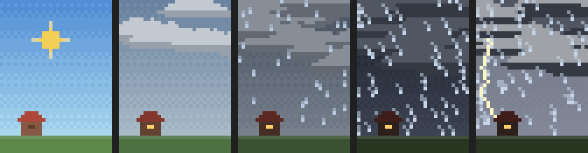
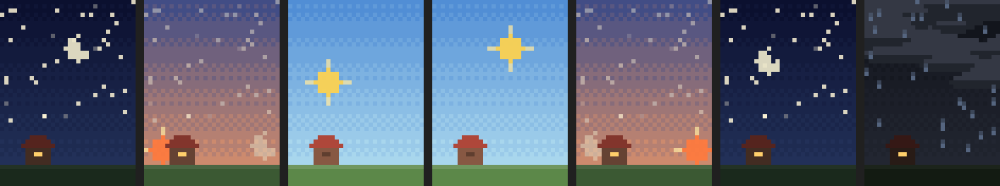

# context-weather

A Claude Code mod that shows a lo-fi pixel weather window beside the conversation. The weather follows how full the context is, and the time of day follows your clock.



## Weather

| Context | Weather |
| --- | --- |
| under 10% | clear skies |
| 10–25% | fair |
| 25–45% | partly cloudy |
| 45–60% | overcast |
| 60–75% | light rain |
| 75–88% | heavy rain |
| 88% and up | thunderstorm, with lightning |

Clouds get bigger and drift faster as the context fills, and the rain slants harder in the wind. The scene eases between levels, so after a compaction the storm clears over a few seconds. A caption under the scene reads like `dusk · heavy rain · 76% context`.

## Time of day



The sun rises at 6:00 and sets at 20:00, local time, crossing the sky between them, with half an hour of twilight on either side. Dawn and dusk tint the sky warm. At night a moon crosses the sky and stars twinkle wherever it is clear. The house's window is lit at night and whenever the weather turns gloomy. The time zone is read from `date +%z` once a minute, so daylight saving changes are picked up.

## Visitors

Every 3 to 8 minutes, at random, someone may pass through, if the weather suits them:

| Weather | Visitor |
| --- | --- |
| clear or fair, by day | a few birds flapping across |
| clear, at night | a shooting star |
| partly cloudy or overcast | someone flying a kite by the house (by day), or a far-off plane with a blinking beacon |
| rain | someone walking out under an umbrella, which blows inside out in heavy rain and sends them running; or a duck, waddling through |
| thunderstorm | a cow, tumbling across on the gale |

At dawn and dusk under a clear sky nobody comes. A visitor who arrives stays until they are out of sight, even if the weather changes.

## Commands

- `/weather` opens or closes the window.
- `/weather at 22:30` shows that time of day instead of the clock (handy for a preview); `/weather at now` follows the clock again.
- `/weather visit cow` sends a visitor by now, whatever the weather: `birds`, `star`, `kite`, `plane`, `umbrella`, `duck` or `cow` (plurals work too).

## Where it shows

- In the terminal's fullscreen layout the window opens by itself, docked beside the transcript, once the terminal is at least 144 columns wide. Narrower, open it with `/weather`.
- On the main screen (not fullscreen) it never opens by itself. `/weather` opens it above the prompt, up to 8 rows tall.
- The pixel scene is terminal-only. In the desktop app's Code tab the window shows the caption alone.
- It animates at 8 frames per second, two pixels per cell (`▀` with separate top and bottom colors).

## Install

```
/plugin marketplace add akerskuuug/claude-mods
/plugin install context-weather@claude-mods
```

Pick the user scope when prompted.

The mod runs as function hooks, which Claude Code only loads when they are switched on. Add this to `~/.claude/settings.json` (if the file already exists, merge `env` into it) and restart Claude Code:

```json
{
  "env": {
    "CLAUDE_CODE_ENABLE_FUNCTION_HOOKS": "1"
  }
}
```

Without it the mod installs but shows nothing.
